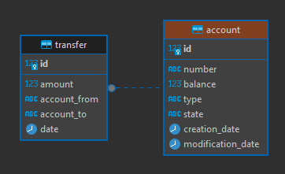

# Arquetipo Reactivo Clean Arquitecture - R2DBC y Servicios AWS

Este arquetipo reactivo contiene implementaciones de R2DBC y algunos servicios de AWS (Secret Manager, SQS), esta diseñado siguiendo los estandares de clean arquitecture. El framework usado en el proyecto es Spring WebFlux con proyect reactor.

El proyecto simula un servicio para realizar transferencias y consulta de movimientos de una cuenta bancaria.

Contiene dos endpoints:

| Endpoint | Tipo | Descripción |
|:-:|:-:|:-:|
| /transfer | POST | Servicio que permite realizar una transferencia entre dos cuentas |
| /movement | POST | Servicio que permite ver los movimientos de una cuenta (paginados) |

En la carpeta principal denominada support se encuentra una colección de postman, con un ejemplo del request de cada servicio.

**Nota:** Por defecto el proyecto esta desplegado en el puerto 8081, las propiedades de configuración del proyecto se encuentran en la carpeta .\backend-reactive-java-aws-service\infrastructure\src\main\resources\application.yml desde alli puede modificar las propiedades que considere necesarias.

## Desplegar Infraestructura

La infraestructura del proyecto se crea usando docker compose, los archivos de configuración se encuentran en la carpeta principal denominada deployment, para desplegar la infraestructura, debe ubicarse sobre la carpeta deployment y se debe ejcutar el siguiente comando:

```bash
  cd .\backend-reactive-java-aws-service\deployment  
  docker-compose -f aws-local.yml --env-file .\variables.env up -d
```
Este comando iniciara dos contenedores, el primero contiene una base de datos postgresql (latest version) y el segundo contiene localstack (AWS local, latest version).

Las variables usadas en los diferentes archivos de despliegue, se encuentran parametrizadas en el archivo variable.env, pueden ser modificadas desde este archivo de acuerdo a sus necesidades.

### Base de datos Postgresql

La base de datos contiene un esquema de tablas simple:

<p align="center">
  
</p>

Por defecto la tabla account contiene 4 cuentas de prueba las cuales son insertadas durante la inicialización del contenedor de la base de datos.

Ademas de las dos tablas, se crean las respectivas secuencias e indices para cada tabla, asi como tambien se generan un par de funciones sql auxiliares para simular un numero de cuenta real y un saldo.

### Localstack (AWS)

Por defecto esta configurado para habilitar los servicio secret manager y SQS.

Al iniciar el contenedor se crea un secreto, relacionado a la conexión de la base de datos postgresql (hostname, username, password, etc) y tambien se crea una cola SQS.

Adjunto algunos comandos para validar la creación de los componentes mencionados:

```bash
# Listar secretos
aws secretsmanager list-secrets --endpoint-url http://localhost:4566
```

```bash
# Obtener secreto por nombre
aws secretsmanager get-secret-value --secret-id connection-db-local-reactive-pragma --endpoint-url http://localhost:4566
```

```bash
# Listar colas
aws sqs list-queues --endpoint-url http://localhost:4566
```

**Nota:** Los nombres de los componentes pueden ser modificados desde el archivo localstack-setup.sh

## Authors

- [@sergio-roncancio](https://github.com/sergio-roncancio)

